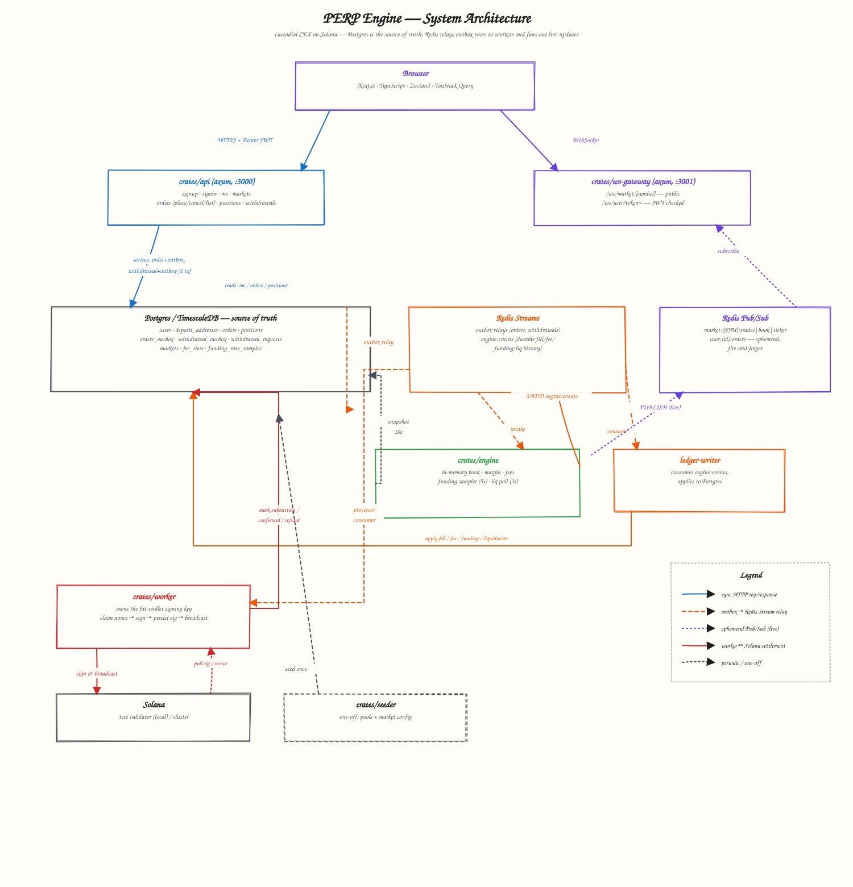

# PERP Engine

A centralized perpetuals exchange on Solana. Users hold a custodial balance managed by this backend and trade it against an in-memory matching engine. This document covers only what currently exists in the codebase.

## Architecture



Postgres is the only source of truth. The API commits state there synchronously (blue); a transactional outbox is relayed onto Redis Streams for the engine and worker to consume asynchronously (orange); the engine additionally fans out live book/trade/order updates over Redis Pub/Sub, which `ws-gateway` relays to the browser (violet); the worker settles withdrawals against Solana directly (red). See the `## Workspace layout`, `## Withdrawals`, and `## Matching Engine` sections below for the mechanism behind each hop.

## Workspace layout

- `crates/api` — public HTTP API (axum). Signup/signin, JWT auth, withdrawal requests, order placement/cancel, positions, market listing.
- `crates/store` — shared Postgres data-access layer (sqlx), used by `api`, `worker`, and `engine`.
- `crates/worker` — background process that owns the fat-wallet signing key, drains the withdrawal queue, indexes incoming deposits, sweeps deposit addresses into the fat wallet, and talks to Solana. Never exposed to the network.
- `crates/engine` — the matching engine: in-memory order book (incl. depth), margin/leverage, funding (fed by a Pyth oracle poller), tiered fees, and liquidation. Owns no signing key and is never exposed to the network either.
- `crates/ws-gateway` — bridges the engine's Redis Pub/Sub channels (`market:{SYMBOL}:trades|book|ticker|depth`, `user:{id}:orders`) to browser WebSocket clients. Stateless relay: no DB access, no signing key.
- `crates/seeder` — one-off bootstrap scripts: deposit-address pool generation, fat-wallet + durable-nonce pool creation, market config seeding.
- `frontend` — minimal Next.js (App Router, TypeScript, Zustand, Tailwind) trading UI: auth, a trade page (chart, book + depth ladder, trades, order entry, open orders, positions), and a wallet page (withdrawals).
- `tests` — integration test suite (`perp-integration-tests`, a separate workspace member) plus `tests/frontend` (Vitest) — see Testing below.

## Custodial account model

Each user is a row in `users` with two balance columns: `collateral_available` (free balance) and `collateral_locked` (reserved for open-position margin — no code currently moves funds into this column, since no matching engine exists yet). Passwords are hashed with argon2 (`crates/store/src/users.rs`). Signin issues a JWT whose `sub` claim is the numeric user id; `crates/api/src/auth.rs` validates that token on protected routes and injects the user id as an `AuthUser` extractor.

## Dedicated deposit addresses

Every user gets their own deposit address, assigned atomically at signup:

- `crates/seeder` derives 1,000 Solana keypairs from a single BIP39 mnemonic (`keys/mnemonic.txt`) using per-index derivation paths, and inserts the public keys into `deposit_addresses` as an unassigned pool.
- `store::users::create_user_with_deposit_address` claims one of those addresses in the same transaction that creates the user row (`UPDATE ... WHERE pubkey = (SELECT ... FOR UPDATE SKIP LOCKED)`), so address assignment can't race or double-assign under concurrent signups.

**Indexing:** `crates/worker/src/deposit_indexer.rs` polls `get_signatures_for_address` for every active deposit address every 10s, bounded by a per-address `deposit_addresses.last_signature` cursor so each poll only scans new signatures. For each new signature it diffs the account's pre/post lamport balance (not instruction parsing, so any transfer type that credits the account is caught) and, on a net-incoming transfer, calls `store::deposits::record_deposit` — one transaction that inserts the `deposits` row (`ON CONFLICT (signature) DO NOTHING`, the idempotency guard) and credits `collateral_available` only if that insert actually happened, so redelivery/restart-driven re-scans of the same signature are safe no-ops.

**Sweeping:** `crates/worker/src/sweeper.rs` ticks every `SWEEP_INTERVAL_SECS` (default 60), re-derives all 1,000 deposit-address keypairs once at startup, and for each address with a balance above `SWEEP_MIN_LAMPORTS` (default 0.01 SOL) past the rent-exempt minimum, signs and sends a plain `system_instruction::transfer` from that deposit keypair to the fat wallet using a fresh blockhash. This is on-chain custody movement only — the ledger was already credited by the indexer, so a failed or delayed sweep never risks a user's balance, only leaves funds parked at the deposit address until the next tick. Deliberately not routed through the withdrawal nonce-account pool: deposit addresses are single-purpose and low-contention, so a plain blockhash transaction is sufficient.

## Withdrawals

The withdrawal path is the most guarded part of the system, since it moves funds out of a centrally-held fat wallet. It's built as a two-phase-commit pipeline: Postgres is the durable source of truth, Redis Streams is a fast ack-based dispatch layer that is never treated as authoritative.

**Request path** (`POST /withdrawals`, JWT-protected):
`store::withdrawals::request_withdrawal` runs one Postgres transaction that: row-locks the user (`SELECT ... FOR UPDATE`), enforces a rolling 24-hour rate limit (`WITHDRAWAL_RATE_LIMIT_PER_DAY`, default 5), checks and debits `collateral_available`, and inserts both the `withdrawal_requests` row and a `withdrawal_outbox` row. All four steps commit together, which is what prevents a check-then-lock race across concurrent requests from the same user.

**Dispatch:** `crates/worker`'s relay tails `withdrawal_outbox` and republishes each row onto a Redis stream (`XADD`). This is a pure transactional-outbox relay — Redis holds no state that Postgres doesn't already have.

**Processing** (`crates/worker/src/processor.rs`), per request:
1. Claim a durable-nonce account from the `fee_payer_nonces` pool (same `FOR UPDATE SKIP LOCKED` pattern as deposit-address assignment).
2. Build and sign the transfer using that nonce. The signature is computed locally and is fully deterministic given the nonce value — no network round-trip needed to know it.
3. **Persist the signature and signed transaction bytes before broadcasting** (`mark_submitting`). This is the core correctness property: if the process crashes between broadcasting and acknowledging the queue entry, a durable, reproducible record of exactly what was sent already exists.
4. Broadcast. Failure (including the chain being unreachable) just leaves the request in `SUBMITTING` for retry — nothing is lost.

**Recovery**, on redelivery of a `SUBMITTING`/`SUBMITTED` request (from Redis `XAUTOCLAIM`, a fresh consumer, or the reconciler):
- Query the chain for the persisted signature. Found and finalized → mark `CONFIRMED`. Found and pending → stays `SUBMITTED`. Chain rejected it → refund atomically (`fail_and_refund`, one transaction: mark `REFUNDED` + credit `collateral_available` back + release the nonce).
- Not found: compare the on-chain nonce value against the one persisted with the request. Unchanged means the transaction never landed — safe to rebroadcast the *identical* signed bytes (same signature, no double-spend). Changed means the transaction almost certainly executed; the request is deliberately **not** auto-refunded, and a critical log line is emitted for manual review, since guessing wrong here risks double-paying the user.

**Redelivery mechanics:** Redis consumer groups (`XREADGROUP`/`XACK`) handle normal processing; `XAUTOCLAIM` reclaims entries abandoned by a crashed consumer after an idle timeout. Independently of Redis, a reconciler sweeps `withdrawal_requests` every 30s for anything stuck in a non-terminal status for more than 2 minutes and re-drives it through the same processing step — so a lost or trimmed Redis entry, a relay outage, or a deleted consumer group still can't strand a request.

**Isolation:** the fat-wallet private key (derived from the same mnemonic as deposit addresses, at a dedicated index) only ever exists in the `worker` process's memory. `api` never has access to it — the pubkey-format validation `api` does on `destination_pubkey` is parsing only.

## Withdrawal state machine

```
QUEUED -> SUBMITTING -> SUBMITTED -> CONFIRMED
   \           \____________\
    \-----------------------> REFUNDED
```

## Matching Engine

The engine (`crates/engine`) is a separate process from `api`, matching orders in memory for speed while Postgres stays the durable source of truth for balances. It reuses the withdrawal pipeline's pattern throughout: transactional outbox → Redis Streams relay → consumer-group processing → idempotent guarded state transitions.

**Consistency model:** margin is reserved in Postgres *before* the engine ever sees an order (`POST /orders` → `store::orders::place_order`, one transaction: row-lock the user, check + debit `collateral_available` → `collateral_locked`, insert the `orders` row + an `orders_outbox` row). The engine's relay drains that outbox onto a Redis stream; the engine matches in memory; every balance-affecting outcome (fill, fee, funding, liquidation transfer) is appended to a second stream, `engine:events`, which an independent ledger-writer consumer applies back to Postgres as small guarded transactions. Postgres balances therefore converge with bounded lag (normally sub-second) rather than being touched on the matching hot path at all.

**Orders:** LIMIT and MARKET, GTC or IOC, LONG or SHORT, reduce-only, cross or isolated margin. LIMIT+GTC rests on the book if unfilled; LIMIT+IOC and MARKET (always treated as IOC) fill what they can and drop the remainder. The book is a per-market `BTreeMap<price, VecDeque<order>>` (price-time priority), matched against `rust_decimal::Decimal` directly rather than a custom fixed-point type — simpler, and this codebase already leans on `Decimal` everywhere else.

**Fees:** tiered maker/taker rates by trailing 30-day volume (`fee_tiers`, refreshed once per UTC day), applied inline per fill so `engine:events` fill records already carry final amounts. The top tier's maker rate is negative — a plain sign-flipped transfer handles the rebate, no special-cased branch.

**Funding:** a 5-second sampler walks the book for the bid/ask VWAP that would fill `impact_notional`, computes the premium index against the mark price, and writes to the `funding_rate_samples` hypertable. Once per UTC hour, `mean_P` over the trailing window is turned into `FR_hour` per the standard 8-hour-formula-divided-by-8 approach and settled against every open position, credited/debited directly to `collateral_available` and tracked in `positions.funding_pnl` separately from trading PnL.

**Liquidation:** margin health (`Equity` vs `MaintenanceMargin`) is polled every 3 seconds rather than recomputed synchronously on every fill — a deliberate simplification of "continuous". Cross evaluates an account's combined cross exposure; isolated evaluates one position independently. For a flagged cross account with more than one open position, the largest-notional position (`|quantity| * mark_price`) is unwound first (`largest_notional_position` in `crates/engine/src/state.rs`), with the next tick picking up whatever's left. A flagged scope is blocked from new order intake (checked in-memory, no Postgres round-trip) and unwound with engine-generated reduce-only IOC orders. If the book can't absorb an unwind and equity has fallen to a small fraction of maintenance margin, the remaining position is transferred directly to the insurance-fund account instead (`backstop_equity_ratio`, per-market). Liquidation fills carry an extra `liquidation_fee_rate` surcharge on top of the normal taker rate.

**Mark/index price:** two distinct prices are now tracked. `mark_price` is still the engine's own last-trade price, mirrored to `markets.mark_price` so `place_order` can size MARKET-order margin without depending on the engine being reachable; it also continues to feed liquidation/backstop math. `index_price` is new: `crates/engine/src/oracle.rs` polls Pyth's Hermes REST API every 3s for each market's configured `markets.pyth_price_feed_id` (seeded by `crates/seeder/src/bin/seed_markets.rs`) and feeds `state.index_prices` via `IntakeCommand::UpdateIndexPrice` — purely in-memory, never persisted, since it's re-fetched from Pyth within seconds of any restart. The funding sampler's premium-index calculation now reads `index_price` (the external oracle) rather than reusing `mark_price` for both roles, which is the textbook Index/Mark split for perp funding.

**Order book depth:** `OrderBook::depth(levels)` (`crates/engine/src/book.rs`) returns the top N price levels per side, each summed to (price, total remaining quantity). It's published on its own `market:{SYMBOL}:depth` Redis channel (`publish_depth`) whenever a book mutates — new order, fill, or cancel, not just fills like the pre-existing `market:{SYMBOL}:book` top-of-book channel — and relayed by `ws-gateway` alongside `trades`/`book`/`ticker`. The frontend renders it as a depth ladder (`components/trade/OrderBookDepth.tsx`).

**Crash recovery:** the match-loop task snapshots its full state (books, positions, fee/mark-price caches, event/trade id counters) to Postgres every 10 seconds. On restart it loads the latest snapshot and resumes — no replay from the event log — so at most ~10 seconds of activity is lost on a crash, a bound accepted up front rather than engineered around.

**Pub/sub:** Redis Streams (`engine:events`) is durable history; Redis Pub/Sub is a separate, ephemeral live feed of the same facts — public per-market channels (`market:{SYMBOL}:trades|book|ticker`) and a private per-user channel (`user:{id}:orders`, `ACCEPTED`/`FILL`/`RESTED`/`CANCELED`/`REJECTED`) so a client can watch its own order resolve in real time instead of reloading. No consumer of these channels exists yet — a WebSocket gateway bridging them to browsers is the next piece, not built here.

## Running locally

```
docker compose up -d                      # postgres (timescaledb), redis, local solana validator
cargo run -p seeder --bin seeder          # populate the deposit-address pool
cargo run -p seeder --bin fund_fatwallet  # fund the fat wallet + create the nonce pool
cargo run -p seeder --bin seed_markets    # seed SOL/ETH/BTC market config
cargo run -p api                          # public API
cargo run -p worker                       # withdrawal processor
cargo run -p engine                       # matching engine
cargo run -p ws-gateway                   # WebSocket bridge for live market/order data

cd frontend && cp .env.local.example .env.local && npm install && npm run dev  # trading UI, http://localhost:3002
```

Env vars: `DATABASE_URL`, `JWT_SECRET`, `SERVER_ADDRESS` (api); `SOLANA_RPC_URL`, `REDIS_URL`, `WORKER_CONCURRENCY`, `SWEEP_INTERVAL_SECS` (default 60), `SWEEP_MIN_LAMPORTS` (default 10_000_000, i.e. 0.01 SOL) (worker); `WITHDRAWAL_RATE_LIMIT_PER_DAY` (api, default 5); `DATABASE_URL`, `REDIS_URL`, `ENGINE_INTAKE_CONCURRENCY` (engine, default 2); `REDIS_URL`, `JWT_SECRET`, `SERVER_ADDRESS` (ws-gateway, default `127.0.0.1:3001` — must share the same `JWT_SECRET` as `api`). `frontend/.env.local`: `NEXT_PUBLIC_API_URL`, `NEXT_PUBLIC_WS_URL`. The Pyth oracle poller has no configuration — it polls `https://hermes.pyth.network` for whichever markets have a non-null `markets.pyth_price_feed_id`.

The local validator image is pinned to `solanalabs/solana:v1.18.26` — newer agave/solana images require `io_uring`, which WSL2's kernel does not support, and `solana-test-validator` panics on startup there.

### Smoke-testing the full flow

Everything above is built and passes its own layer of checks (`cargo check`/`clippy`, `tsc --noEmit`, `eslint`, `next build`), but wiring six live processes together (`postgres`, `redis`, `solana-test-validator`, `api`, `worker`, `engine`, `ws-gateway`, `frontend`) hasn't been exercised end-to-end against a live stack in this environment. To verify it yourself, after the steps above are all running:

1. Open `http://localhost:3002`, sign up, and confirm you land on `/trade/SOL` with a deposit address assigned (check the `users`/`deposit_addresses` tables, or the `GET /me` response — the UI shows balances in the navbar). Send SOL to that address from the local validator and confirm `collateral_available` increases within ~10s (`deposit_indexer`), then confirm the deposit address's on-chain balance drops back to ~rent-exempt minimum within the sweep interval (`sweeper`).
2. Place a LIMIT order — confirm it appears in "Open orders", the navbar's `collateral_locked` increases, and a browser WS frame arrives on `/ws/user` (`ACCEPTED`/`RESTED`).
3. From a second signed-up account, place a crossing order on the same market and confirm both sides show a `FILL` order event, "Positions" populates on both accounts, and the trade appears in the recent-trades feed on `/trade/SOL` (`market:SOL:trades` over `/ws/market/SOL`).
4. Cancel a resting order — confirm `collateral_locked` is refunded back to `collateral_available`.
5. Request a withdrawal — confirm it shows `QUEUED` in `/wallet`, then progresses through the worker's states (`SUBMITTING`/`SUBMITTED`/`CONFIRMED`) as `crates/worker` processes it against the local validator.

## API

| Route | Auth | Description |
|---|---|---|
| `GET /health` | none | DB connectivity check |
| `POST /signup` | none | Create a user, assign a deposit address |
| `POST /signin` | none | Returns a JWT |
| `GET /markets` | none | List market config (tick/lot size, max leverage, mark price, ...) |
| `GET /me` | bearer JWT | Caller's balances (`collateral_available`, `collateral_locked`) |
| `POST /withdrawals` | bearer JWT | Queue a withdrawal (`amount`, `destination_pubkey`) |
| `GET /withdrawals` | bearer JWT | List the caller's withdrawal requests, newest first |
| `POST /orders` | bearer JWT | Place an order (`market`, `variant`, `order_type`, `tif`, `reduce_only`, `leverage`, `margin_mode`, `price`, `quantity`) |
| `DELETE /orders/{id}` | bearer JWT | Cancel an open order, refunding unfilled margin |
| `GET /orders` | bearer JWT | List the caller's open orders |
| `GET /positions` | bearer JWT | List the caller's open positions |

## WebSocket gateway (`crates/ws-gateway`)

Bridges the engine's Redis Pub/Sub channels to browser clients — a thin relay with no DB access and no signing key.

| Route | Auth | Forwards |
|---|---|---|
| `GET /ws/market/{symbol}` | none | `market:{SYMBOL}:trades\|book\|ticker\|depth` as `{"channel": "trades"\|"book"\|"ticker"\|"depth", "data": ...}` frames |
| `GET /ws/user?token=<jwt>` | JWT in query param (browsers can't set `Authorization` on a WS upgrade) | `user:{id}:orders` as `{"channel": "orders", "data": ...}` frames |

## Not yet built

- Deposit-address balance reconciliation against a chain reorg/rollback (the indexer trusts `confirmed` commitment; a deeper reorg than that is not specially handled)
- SPL-token deposits/withdrawals (native SOL only, throughout)
- A UI affordance for oracle vs. book mark price divergence (the frontend shows `ticker.mark_price`; `index_price` isn't surfaced anywhere in the UI yet, only used internally by the funding sampler)

## Testing

- **Unit tests** (fast, no infra) are colocated as `#[cfg(test)] mod tests` in the crates whose pure logic they cover — e.g. `crates/engine/src/book.rs` (depth/VWAP math) and `crates/engine/src/state.rs` (cross-liquidation largest-notional selection, `crates/engine/src/oracle.rs` (Pyth price parsing). Run with `cargo test --workspace --exclude perp-integration-tests`.
- **Integration tests** live in the top-level `tests/` directory (a separate Cargo workspace member, `perp-integration-tests`) and exercise `store::*` functions, the API router in-process (`api::build_app` + `tower::ServiceExt::oneshot`), and the ledger-application functions, all against a real Postgres (`sqlx::migrate!` runs the shared `migrations/` directory automatically). Run with `cargo test -p perp-integration-tests` against `docker compose up -d postgres redis`.
- One integration test, `worker_deposit_withdrawal_e2e`, exercises the full airdrop → deposit-index → sweep → withdrawal round trip against a live `solana-test-validator`. It's `#[ignore]`d by default; run it explicitly with `cargo test -p perp-integration-tests -- --ignored` after `docker compose up -d solana-test-validator`.
- **Frontend tests** live in `tests/frontend/` (Vitest + Testing Library), covering the WS hook's channel dispatch (including `depth`) and the order-book components. Run with `cd frontend && npm run test` (the script points Vitest at `../tests/frontend/vitest.config.ts`, so tests stay physically consolidated under `tests/` while still resolving `frontend/`'s `@/*` imports and `node_modules`).
- `scripts/run-tests.sh` runs everything above in order against a fresh `docker compose` stack (`--with-validator` to include the Solana e2e suite too).
